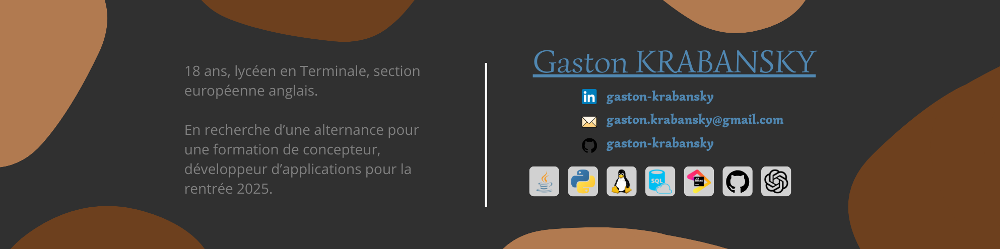

-----
### 🇺🇸 | For English version, click [here](README_en.md).

# 👤 | Qui suis-je ?

> 👋 Bonjour, je m'appelle **Gaston**, j'ai **18** ans et je suis **Français**. 
> 🖥️ Je suis passionné par **l'informatique** et **la programmation**. 
> 📚 Je suis en **classe de terminale**, et j'ai rejoint la **Section européenne d'anglais**. 
> 🔬 Je code principalement en **Java** sous le pseudonyme *Sniepr_TVmc*, mais j'ai également de bonnes connaissances avec **Python**. 
> ✉️ N'hésitez pas à me **contacter par e-mail** à l'adresse suivante : [gaston.krabansky@gmail.com](mailto:gaston.krabansky@gmail.com).

# 📚 | Études

*En savoir plus sur mon parcours*

### 🏫 | Lycée
> 📍 Lieu : **Lycée Marguerite de Flandre**, Gondecourt, France 
> 📕 Spécialités : **Numérique et Sciences Informatiques** et **Mathématiques** 
> 🌐 Langues vivantes : **anglais** et **italien** 
> 🗓️ Date d'arrivée/de fin : **septembre 2022 - juillet 2025**.

_Je suis toujours lycéen..._

# 📈 | Compétences

*Découvrez mes compétences et mes domaines d'expertise*

### 🖥️ | Langages de programmation :
> 🍵 **Java**, Plus de 2 ans d'expérience _(Langage que j'utilise principalement)_ 
> 🐍 **Python**, Environ 2 ans d'expérience _(Langage avec de solides bases)_ 
> 🛡️ **Langages Front-end de base**, Niveau débutant _(HTML / CSS / JavaScript)_ 
> 💾 **SQL**, Environ 1 an d'expérience _(gestion de base de données)_ 
> ✨ **Skript Language**, Plus de 2 ans d'expérience _(gestion de serveur Minecraft, je ne l'utilise plus)_

### 🛠️ | Outils :
> 👨‍💻 **JetBrains** EDIs _(IntelliJ IDEA, PyCharm, PhpStorm)_ 
> 📝 **Visual Studio Code**, **NotePad++**, **Sublime Text** 
> ⛓️‍💥 **Git**, **GitHub** 
> 🤖 **ChatGPT**, **GitHub Copilot** 
> 💻 **Linux** _(Debian)_, **Windows** _(10, 11)_ 
> ⚙️ **Pterodactyl**, **PhpMyAdmin**, **Webmin**

### 🔗 | Autres

> 🎨 **Canva**, **Notion**, **Gitbook** 
> 📄 **Apache**, **poste.io**

# 📦 | Projets

*Découvrez mes projets et réalisations*

> ⚠️ **Note** : Malheureusement, la plupart de mes projets sont **privés** ou **non disponibles** sur GitHub. 
> Par conséquent, j'ai très peu de projets représentant mon niveau dans les différents langages. 
>
> - 🧷 Si vous souhaitez en savoir plus sur mes projets privés dans un **contexte strictement professionnel**, n'hésitez pas à me contacter par mail. 
> - 🧷 Je serais heureux de vous en dire plus sur mes projets et de vous fournir des exemples de code.

### 🧪 | EssentialsX-GUI *(Plugin Minecraft)*

> 🏷️ **Description** : Un addon à EssentialsX qui lui ajoute des interfaces graphiques pour ses principales fonctionnalités, comme les "homes", les "kits", les "warps", etc. 
> 🌐 **Langage** : Java _(Spigot API)_ 
> 📊 **État** : En cours de développement _(Version bêta disponible)_ 
> 🗃️ **Dépôt GitHub** : [EssentialsX-GUI](https://github.com/SniperTVmc/EssentialsX-GUI) 

# 📊 | Statistiques

*Découvrez mes statistiques GitHub*

> ⚠️ **Note** : Ces statistiques sont basées sur mes dépôts publics uniquement. 

 

# 📞 | Contact

*Contactez-moi par e-mail ou sur les réseaux sociaux*

> 💼 **LinkedIn**: [gaston-krabansky](https://www.linkedin.com/in/gaston-krabansky/) 
> 📷 **Github**: [gaston-krabansky](https://github.com/gaston-krabansky/) 
> ✉️ **Email**: [snipertv59.pro@gmail.com](mailto:gaston.krabansky@gmail.com) 
